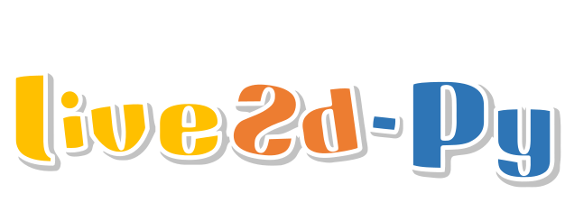

<div align="center" style="padding-top: 10px">
    
    
</div>

<p align="center" style="font-family: 'Roboto', sans-serif; font-size: 1em; color: #555;">
    
    <br>
    
    <br>
    
    
    
    
</p>

[中文](./README.md)

Load and manipulate Live2D models using pure Python instead of web engine (JavaScript). 

The functionalities of Live2D Native SDK are wrapped into Python via Python C API. 

Theoretically, Live2D models can be rendered on any OpenGL-based windows in Python as long as the OpenGL context is properly configured.   

Code example: [package](./package/)

Documentation：[Wiki](https://github.com/Arkueid/live2d-py/wiki)

Guide for dev：[CONTRIBUTING](./CONTRIBUTING.md)

## Compatible UI Libraries  
Theoretically compatible with all UI libraries that can use OpenGL for rendering: Pygame / PyQt5 / PySide2 / PySide6 / GLFW / pyopengltk / FreeGlut / Qfluentwidgets...   

# Supported Features  
* **Model Loading**: **Cubism 2.1** and **Cubism 3.0** or later  
* Eye tracking  
* Click interaction  
* Motion playback callback  
* Lip-sync synchronization  
* Parameter control for model parts  
* Opacity control for parts  
* Precise part-level click detection  

## Compatibility  
### Python Versions  
Starting from live2d-py 0.3.2, the Python C Limited API is used, theoretically supporting all Python versions **3.2 and above**.  

### Cubism Live2D Versions  
| `live2d-py` | Supported Live2D Models       | Implementation                | Supported Python Versions                  | Supported Platforms           |  
|-------------|-------------------------------|-------------------------------|--------------------------------------------|-------------------------------|  
| `live2d.v2` | Cubism 2.1 and earlier        | Pure Python implementation    | 32/64-bit, **Python 3.0+**                | Windows, Linux, macOS (maybe) |  
| `live2d.v3` | Cubism 3.0 and later          | Python C Extension wrapper    | 32/64-bit, **Python 3.2+**                | Windows, Linux                 |  

**Notes**:  
* `live2d.v2` is rewritten from the Cubism Web SDK into pure Python and has not yet been optimized with libraries like numpy, resulting in lower performance [[4, 15]].  
* **Cubism 2.X models**: File formats typically include `XXX.moc`, `XXX.model.json`, `XXX.mtn`.  
* **Cubism 3.0+ models**: File formats typically include `XXX.moc3`, `XXX.model3.json`, `XXX.motion3.json`.  

# Installation
1. Integrate the `package/live2d` module directly into your project.  

2. Download the corresponding `.whl` file from [Releases](https://github.com/Arkueid/live2d-py/releases/latest) and install it (recommended):  
```shell
pip install live2d_py-0.X.X-cpXXX-cpXXX-win32.whl  
```

3. Install via [PyPI](https://pypi.org/project/live2d-py/)
```
pip install live2d-py  
```

4. Build from source. Refer to [安装#源码构建](https://github.com/Arkueid/live2d-py/wiki/%E5%AE%89%E8%A3%85#%E6%BA%90%E7%A0%81%E6%9E%84%E5%BB%BA). 

## Simple Facial Motion Capture Example
Source code: [main_facial_bind_mediapipe.py](./package/main_facial_bind.py)


## Contributions
Special thanks to [@96bearli], [@Ovizro], [@AnyaCoder], [@jahtim], [@Hongehe] and [@RobertMeow] for their support and contributions to this project.

[@96bearli]: https://github.com/96bearli

[@Ovizro]: https://github.com/Ovizro

[@AnyaCoder]: https://github.com/AnyaCoder

[@jahtim]: https://github.com/jahtim

[@Honghe]: https://github.com/Honghe

[@RobertMeow]: https://github.com/RobertMeow