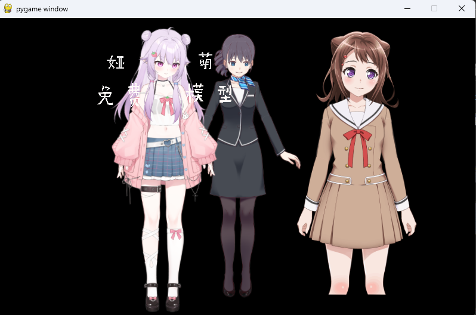
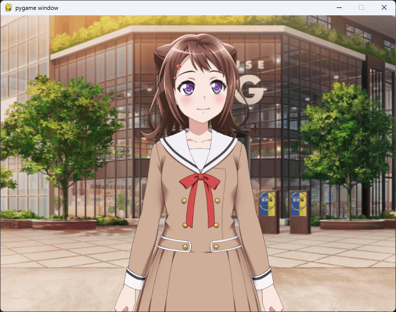
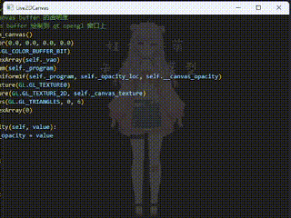

<div align="center">
    <h1>
        
        <span style="color: #ffc000ff">live</span><span style="color: #ed7d31ff">2d</span><span style="color: #2e75b6ff">-py</span>
    </h1>
</div>

<p align="center" style="font-family: 'Roboto', sans-serif; font-size: 1em; color: #555;">
    
    
    
    <br>
    
    
    
    
    
</p>

[中文](./README.md)

Load and manipulate Live2D models using pure Python instead of web engine (JavaScript). 

The functionalities of Live2D Native SDK are wrapped into Python via Python C Extension. 

Theoretically, Live2D models can be rendered on any OpenGL-based windows in Python as long as the OpenGL context is properly configured.   

Code example: [examples](./examples/)

Documentation：[Wiki](https://github.com/Arkueid/live2d-py/wiki)

Guide for dev：[CONTRIBUTING](./CONTRIBUTING.md)

## Compatible UI Libraries  
Theoretically compatible with all UI libraries that can use OpenGL for rendering: Pygame / PyQt5 / PySide2 / PySide6 / GLFW / pyopengltk / FreeGlut / Qfluentwidgets...   

# Supported Features  
* **Model Loading**: **Cubism 2.1** and **Cubism 3.0** or later  
* Eye tracking  
* Click interaction  
* Motion playback callback  
* Lip-sync synchronization  
* Parameter control for model parts  
* Opacity control for parts  
* Precise part-level click detection  

## Compatibility  
### Python Versions  
Starting from live2d-py 0.3.2, the Python C Limited API is used, theoretically supporting all Python versions **3.2 and above**.  

### Cubism Live2D Versions  
| `live2d-py` | Supported Live2D Models       | Implementation                |
|-------------|-------------------------------|-------------------------------| 
| `live2d.v2` | Cubism 2.1 and earlier        | Pure Python implementation    |
| `live2d.v3` | Cubism 3.0 and later          | Python C Extension wrapper    |

### Python Versions and Platform

:white_check_mark:: available, supported, or passing 

:question:: tests needed

:construction:, :x:: errors or compatibility issues need to be solved when building distributions 

|Platform|Python Version| `live2d.v2` | `live2d.v3` |Build Status|PyPI|
|--------|--------------|-------------|-------------|------|----------|
|MacOS  arm64| `>3.0, <=3.10`|:white_check_mark:|:question:|:construction:|:x:|
|MacOS  arm64| `>=3.11`      |:white_check_mark:|:white_check_mark:|:white_check_mark:|:white_check_mark:|
|Windows x86/x64|`>3.0, <3.8`|:white_check_mark:|:question:|:construction:|:x:|
|Windows x86/x64|`>=3.8`|:white_check_mark:|:white_check_mark:|:white_check_mark:|:white_check_mark:|
|Ubuntu 20.04/Arch, x64|`>3.0, <3.8`|:white_check_mark:|:question:|:construction:|:x:|
|Ubuntu 20.04/Arch, x64|`>=3.8`|:white_check_mark:|:white_check_mark:|:white_check_mark:|:x:|

**Notes**:  
* `live2d.v2` is rewritten from the Cubism Web SDK into pure Python and has not yet been optimized with libraries like numpy, resulting in lower performance [[4, 15]].  
* **Cubism 2.X models**: File formats typically include `XXX.moc`, `XXX.model.json`, `XXX.mtn`.  
* **Cubism 3.0+ models**: File formats typically include `XXX.moc3`, `XXX.model3.json`, `XXX.motion3.json`.  

# Installation

1. Download the corresponding `.whl` file from [Releases](https://github.com/Arkueid/live2d-py/releases/latest) and install it (recommended):  
```shell
pip install live2d_py-0.X.X-cpXXX-cpXXX-win32.whl  
```

2. Install via [PyPI](https://pypi.org/project/live2d-py/)
```
pip install live2d-py  
```

3. Build from source. Refer to [安装#源码构建](https://github.com/Arkueid/live2d-py/wiki/%E5%AE%89%E8%A3%85#%E6%BA%90%E7%A0%81%E6%9E%84%E5%BB%BA). 

## Demos

### Simple Facerig

Source code: [main_facial_bind_mediapipe.py](./examples/main_facial_bind.py)


### Live2DViewer based on live2d-py C Module and Qt


### Multi-live2d model rendering

Source code: [main_pygame_three_model.py](./examples/main_pygame_three_model.py)



### Rendering with background image

Source code: [main_pygame_background.py](./examples/main_pygame_background.py)



### Model transforming & lipsync with `wav` file & Click test

Source code: [main_pygame.py](./examples/main_pygame.py)


### Model Opacity

Source Code: [main_pyqt5_canvas_opacity.py](./examples/main_pyqt5_canvas_opacity.py)



## Contributions
Special thanks to [96bearli], [Ovizro], [AnyaCoder], [jahtim], [Honghe], [RobertMeow], [LUORANCHENG], [TinyKiecoo], [Barracuda72], [GuangChen2333], [makabakadot], [thynetruly], [mastwet], [KyvYang] for their support and contributions to this project.

[96bearli]: https://github.com/96bearli

[Ovizro]: https://github.com/Ovizro

[AnyaCoder]: https://github.com/AnyaCoder

[jahtim]: https://github.com/jahtim

[Honghe]: https://github.com/Honghe

[RobertMeow]: https://github.com/RobertMeow

[LUORANCHENG]: https://github.com/LUORANCHENG

[TinyKiecoo]: https://github.com/TinyKiecoo

[Barracuda72]: https://github.com/Barracuda72

[GuangChen2333]: https://github.com/GuangChen2333

[makabakadot]: https://github.com/makabakadot

[thynetruly]: https://github.com/thynetruly

[mastwet]: https://github.com/mastwet

[KyvYang]: https://github.com/kyv001

Special thanks to the following repos and their contributors:

[CubismNativeSamples](https://github.com/Live2D/CubismNativeSamples) (`live2d.v3`)

[Cubism2 Web SDK](https://github.com/dylanNew/live2d) (`live2d.v2`)

[de4js](https://github.com/lelinhtinh/de4js)（`JavaScript` deobfuscation）

[JsConvert](https://github.com/JonBoynton/JSConvert) (Tool for converting `Javascript` to `Python`)

[D2Evil](https://github.com/UlyssesWu/D2Evil) (`moc` file exploration)

[facial-landmarks-for-cubism](https://github.com/adrianiainlam/facial-landmarks-for-cubism) （facerig）

Live2D sources:

* [Cubism Official Sample Data](https://www.live2d.com/en/learn/sample/)
* [雅萌工作室](https://yameng.remoon.cn/studio/live2d-f/1)
* [live2d-models](https://github.com/Eikanya/Live2d-model)
* [【虚拟主播模型】 宁宁vup化！](https://www.bilibili.com/video/BV1s7411d7y9)