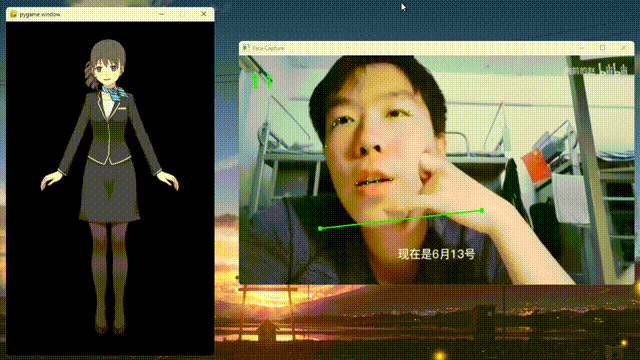
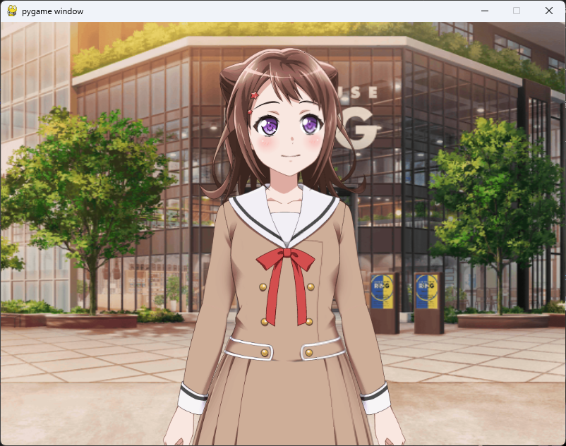
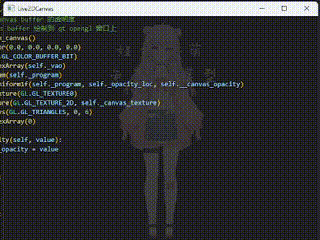

<div align="center" style="padding-top: 10px">
    <h1>
        
        <span style="color: #ffc000ff">live</span><span style="color: #ed7d31ff">2d</span><span style="color: #2e75b6ff">-py</span>
    </h1>
</div>

<p align="center" style="font-family: 'Roboto', sans-serif; font-size: 1em; color: #555;">
    
    
    
    <br>
    
    
    
    
    
    <br>
    <a href="https://github.com/Arkueid/live2d-py/blob/main/README.en.md">English README</a>
</p>

使用 Python 直接加载和操作 Live2D 模型，不通过 Web Engine 等间接手段进行渲染。

基于 Python C++ API 对 Live2D Native SDK (C++) 进行了封装。理论上，只要配置好 OpenGL 上下文，可在 Python 中将 live2d 绘制在任何基于 OpenGL 的窗口。

代码使用示例：[package](./package/)

详细使用文档：[Wiki](https://github.com/Arkueid/live2d-py/wiki)

修改和开发：[CONTRIBUTING](./CONTRIBUTING.md)

## 兼容UI库

理论上兼容所有能使用 OpenGL 进行绘制的UI库： Pygame / PyQt5 / PySide2 / PySide6 / GLFW / pyopengltk/ FreeGlut / Qfluentwidgets ...

## 支持功能

* 加载模型：**Cubism 2.1** 和 **Cubism 3.0** 及以上版本
* 视线跟踪
* 点击交互
* 动作播放回调
* 口型同步
* 模型各部分参数控制
* 各部件透明度控制
* 精确到部件的点击检测

## 兼容性

### Python 版本
Python 版本支持：从 live2d-py 0.3.2 开始使用 Python C Limited API，理论上兼容 Python 3.2 以上的所有版本。

### Cubism Live2D 版本

| `live2d-py` | 支持的live2d模型        | 实现                    |              
|-------------|--------------------|-----------------------|
| `live2d.v2` | Cubism 2.1 以及更早的版本 | 纯 Python 实现           | 支持 `32` / `64` 位，支持`Python 3.0` 及以上版本 | Winodws、Linux、MacOS（理论上） |                                                       |
| `live2d.v3` | Cubism 3.0 及以上版本   | Python C Extension 封装 | 支持 `32` / `64` 位，支持`Python 3.2` 及以上版本 | Windows、Linux            |

### Python 版本及平台

:white_check_mark:: 可用, 支持, 已通过

:question:: 尚未测试

:construction:, :x:: 编译期问题或平台兼容性问题待解决 

|Platform|Python Version| `live2d.v2` | `live2d.v3` |构建状态|PyPI|
|--------|--------------|-------------|-------------|------|----------|
|MacOS  arm64| `>3.0, <=3.10`|:white_check_mark:|:question:|:construction:|:x:|
|MacOS  arm64| `>=3.11`      |:white_check_mark:|:white_check_mark:|:white_check_mark:|:white_check_mark:|
|Windows x86/x64|`>3.0, <3.8`|:white_check_mark:|:question:|:construction:|:x:|
|Windows x86/x64|`>=3.8`|:white_check_mark:|:white_check_mark:|:white_check_mark:|:white_check_mark:|
|Ubuntu 20.04/Arch, x64|`>3.0, <3.8`|:white_check_mark:|:question:|:construction:|:x:|
|Ubuntu 20.04/Arch, x64|`>=3.8`|:white_check_mark:|:white_check_mark:|:white_check_mark:|:x:|

注：

* `live2d.v2` 由 Cubism Web SDK 转写为纯 Python，尚未使用 numpy 等优化的库，性能有待提升
* Cubism 2.X 导出的模型：文件名格式常为 `XXX.moc`，`XXX.model.json`，`XXX.mtn`
* Cubism 3.0 及以上导出的模型：文件名格式常为 `XXX.moc3`，`XXX.model3.json`, `XXX.motion3.json`

## 使用说明

1. 在 [Release](https://github.com/Arkueid/live2d-py/releases/latest) 中下载对应版本的 `whl` 文件并安装（推荐）

```shell
pip install live2d_py-0.X.X-cpXXX-cpXXX-win32.whl
```

2. 通过 [PyPI](https://pypi.org/project/live2d-py/) 安装

```shell
pip install live2d-py
```

3. 从源码构建，参考 [安装#源码构建](https://github.com/Arkueid/live2d-py/wiki/%E5%AE%89%E8%A3%85#%E6%BA%90%E7%A0%81%E6%9E%84%E5%BB%BA)

## 示例

### 简易面捕

源码见 [main_facial_bind_mediapipe.py](./package/main_facial_bind.py)



### 多模型加载

源码见 [main_pygame_three_model.py](./package/main_pygame_three_model.py)


### 添加背景

源码见 [main_pygame_background.py](./package/main_pygame_background.py)



### 模型变换 & 口型同步音频 & 点击测试

源码见 [main_pygame.py](./package/main_pygame.py)


### 模型整体透明度示例

源码见 [main_pyqt5_canvas_opacity.py](./package/main_pyqt5_canvas_opacity.py)



## 鸣谢

特别感谢 [96bearli]，[Ovizro], [AnyaCoder], [jahtim], [Honghe], [RobertMeow], [LUORANCHENG], [TinyKiecoo] 为本项目提供的帮助和支持。

[96bearli]: https://github.com/96bearli

[Ovizro]: https://github.com/Ovizro

[AnyaCoder]: https://github.com/AnyaCoder

[jahtim]: https://github.com/jahtim

[Honghe]: https://github.com/Honghe

[RobertMeow]: https://github.com/RobertMeow

[LUORANCHENG]: https://github.com/LUORANCHENG

[TinyKiecoo]: https://github.com/TinyKiecoo

非常感谢以下项目及其贡献者们的帮助：

[CubismNativeSamples](https://github.com/Live2D/CubismNativeSamples) (`live2d.v3`)

[Cubism2 Web SDK](https://github.com/dylanNew/live2d) (`live2d.v2`)

[de4js](https://github.com/lelinhtinh/de4js)（`JavaScript` 反混淆工具）

[JsConvert](https://github.com/JonBoynton/JSConvert) (`Javascript` 转 `Python` 工具)

[D2Evil](https://github.com/UlyssesWu/D2Evil) (`moc` 文件分析)

[facial-landmarks-for-cubism](https://github.com/adrianiainlam/facial-landmarks-for-cubism) （面捕参考）

Live2D 模型:

* [Cubism 官方样例数据](https://www.live2d.com/en/learn/sample/)
* [雅萌工作室](https://yameng.remoon.cn/studio/live2d-f/1)
* [live2d-models](https://github.com/Eikanya/Live2d-model)
* [【虚拟主播模型】 宁宁vup化！](https://www.bilibili.com/video/BV1s7411d7y9)