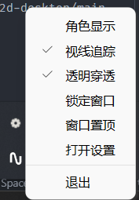
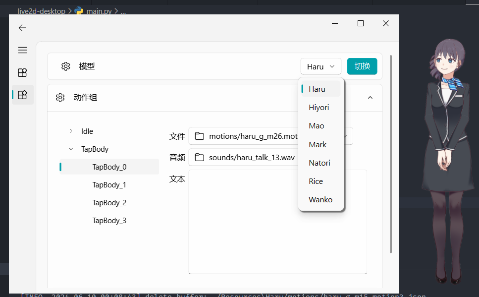
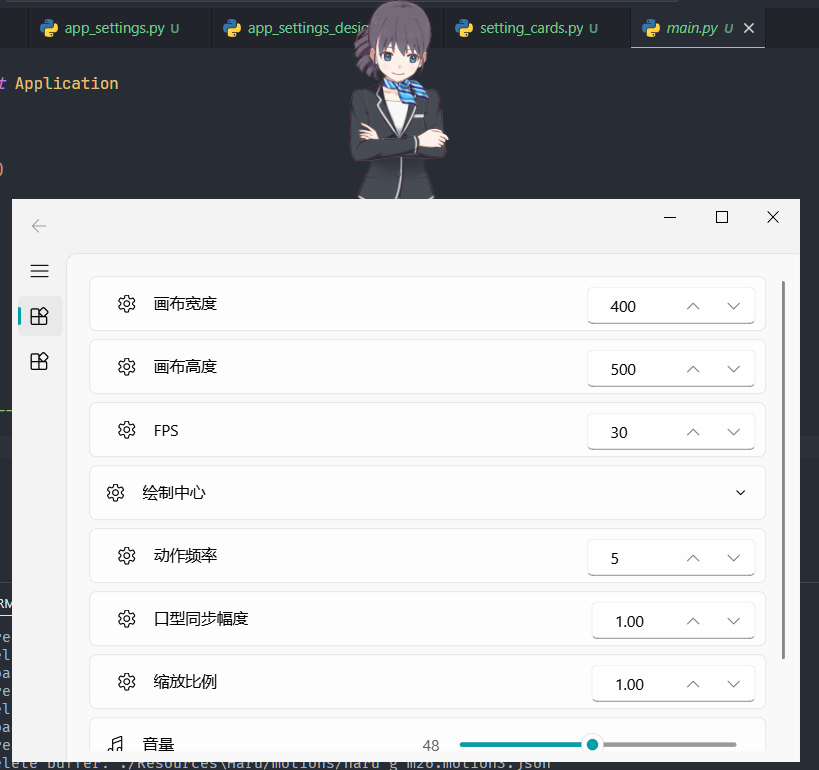
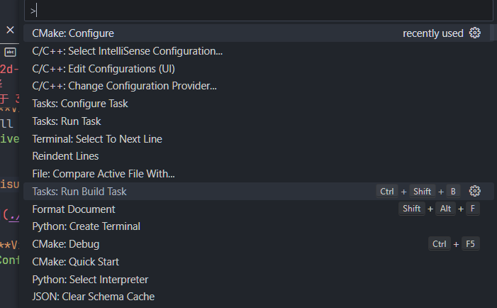
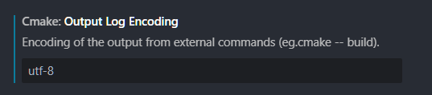
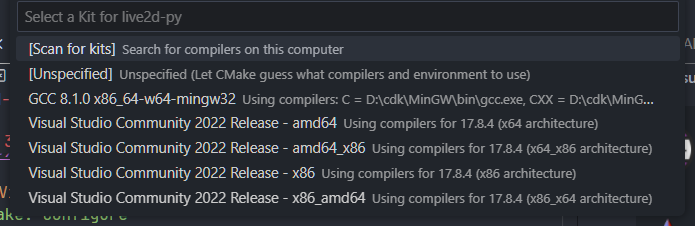
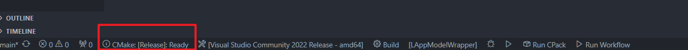
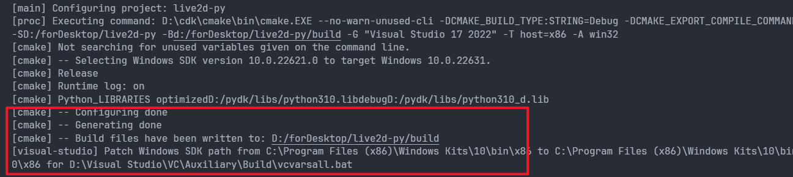

# live2d-py

在 Python 中直接加载和操作 Live2D 模型，不通过 Web Engine 等间接手段进行渲染，提供更高的自由度和拓展性。

Python 的 Live2D 拓展库。基于 Python C++ API 对 Live2D Native (C++) 进行了封装。理论上，只要配置好 OpenGL 上下文，可在 Python 中将 live2d 绘制在任何基于 OpenGL 的窗口。

支持 Live2D 模型版本：
* Cubism 2.X 导出的模型：文件名格式常为 `XXX.moc`，`XXX.model.json`，`XXX.mtn`
* Cubism 3.0 及以上导出的模型：文件名格式常为 `XXX.moc3`，`XXX.model3.json`, `XXX.motion3.json` 

支持窗口库：
* PyQt5
* PySide2 / PySide6
* GLFW
* FreeGlut
* ...

功能：
* 加载模型
* 鼠标拖拽视线
* 鼠标点击触发动作
* 动作播放回调函数
* 口型同步
* 模型各部分参数控制

|`live2d-py`|支持的live2d模型|支持的Python版本|支持平台|
|-|-|-|-|
|`live2d.v2`|Cubism 2.0 及以上，不包括 3.0|仅 32 位，支持`Python 3.0` 及以上版本，但除 `Python 3.10.11` 外需要自行编译|Windows
|`live2d.v3`|Cubism 3.0 及以上，包括 4.0|支持 `32` / `64` 位，支持`Python 3.0` 及以上版本，但除 `Python 3.12` 外需要自行编译|Windows、Linux

本仓库已发布的版本中：
* v2 版本仅支持：**Python 3.10.11 (win32)**
* v3 版本仅支持：**Python 3.12+ (win64)**


若需要 64 位或 linux 平台支持，则需要拉取本仓库源码使用 CMake 编译。

对于适用 Cubism 2.0 模型，目前只支持 32 位，因为当前网络上能找到的现存 live2d opengl 静态库只有 32 位。

## 文件说明

```shell
live2d-py
|-- CMakeLists.txt # CMake 配置文件，用于生成 live2d-py 
|-- Core # Cubism Live2D Core 头文件和库文件，详情见 Cubism 官方
|-- Framework # Cubism 开发框架
|-- LAppModelWrapper.cpp # live2d native 的 python 封装
|-- Main  # live2d native 类
|-- README.md
|-- Resources # 资源文件夹，live2d 模型，应用图标
|-- docs
|-- glew     # opengl 接口依赖
|-- include  # 项目包含目录
`-- package  # 生成的 live2d-py 包，可用 setup.py 打包和安装
```

## 基于 live2d-py + qfluentwidgets 实现的桌面应用预览

见 [live2d-desktop](https://github.com/Arkueid/Live2DMascot)








## 使用说明
Cubism 2.0 模型使用接口见 [package/live2d/v2/live2d.pyi](./package/live2d/v2/live2d.pyi)。

Cubism 3.0（含4.0） 模型使用接口见 [package/live2d/v3/live2d.pyi](./package/live2d/v3/live2d.pyi)。

具体与图形库结合的用例示例见 [package](./package/) 文件夹。

文件：
* `live2d.so` 和 `live2d.pyd`：封装了 c++ 类的动态库，供 python 调用。在 `import live2d.vX as live2d` 时，解释器在文件目录中寻找 `live2d.so`/`live2d.pyd` 并载入内存。其中 `live2d.pyd` 在 windows 下使用，`live2d.so` 在 linux 下使用。
* `live2d.pyi`：python 接口提示文件，仅用于在 IDE 编写时产生代码提示和补全信息。

### 导入库

将 `package/live2d` 文件夹放置在使用者 `main.py` 同目录下，在 `main.py` 中使用如 `import live2d.v2`。

```
live2d-desktop\live2d
|-- v2
|   |-- __init__.py
|   |-- live2d.pyd
|   `-- live2d.pyi
`-- v3
    |-- __init__.py
    |-- live2d.pyd
    |-- live2d.pyi
    `-- live2d.so
```

### 绘制流程
#### 1. 导入 live2d

##### 导入适用于 3.0 版本的 live2d 库
```python
import live2d.v3 as live2d
```

##### 导入适用于 2.0 版本的 live2d 库 
```python
import live2d.v2 as live2d
```

#### 2. 在加载和使用 live2d 模型前，应初始化 live2d 模块
```python
live2d.init()
```

#### 3. （3.0及以上版本）在对应的窗口库中设置 OpenGL 上下文后，初始化 Glew 和 OpenGL 绘制选项。不同的窗口库方法不一样，以 Pygame 为例：
```python
display = (800,600)
pygame.display.set_mode(display, DOUBLEBUF|OPENGL)

# live2d.v3 还需要调用如下函数
live2d.glewInit()
live2d.setGLProperties()
```

#### 4. 在上述步骤全部完成后，方可创建 `LAppModel` 并加载本地模型。路径如下：
```
Resources\Haru
|-- Haru.2048
|-- Haru.cdi3.json
|-- Haru.moc3
|-- Haru.model3.json
|-- Haru.model3.json.bak
|-- Haru.physics3.json
|-- Haru.pose3.json
|-- Haru.userdata3.json
|-- expressions
|-- motions
`-- sounds
```

```python
model = live2d.LAppModel()
model.LoadModelJson("./Resources/Haru/Haru.model3.json")
```

#### 5. 窗口大小变化时调用 `LAppModel` 的 `Resize` 方法。**初次加载时，即使没有改变大小也应设置一次大小，否则模型不显示。**
```python
model.Resize(800, 600)
```

#### 6. 鼠标点击时调用 `LAppModel` 的 `Touch` 方法。传入的参数为鼠标点击位置在窗口坐标系的坐标，即以绘图窗口左上角为原点，右和下为正方向的坐标系。
```python
# 如果鼠标点击位置是可触发动作区域，且对应动作被触发，
# 则会在动作开始播放前调用该函数
def onStartCallback(group: str, no: int):
    print(f"touched and motion [{group}_{no}] is started")

# 动作播放结束后会调用该函数
def onFinishCallback():
    print("motion finished")

x, y = pygame.mouse.get_pos()
model.Touch(x, y, onStartCallback, onFinishCallback)
```

#### 7. 每帧绘制图像时，先清空画布，使用 `live2d.clearBuffer`，再调用 `LAppModel` 的 `Update` 函数。在使用具体的窗口库时，需要调用缓冲刷新函数。
```python
live2d.clearBuffer()
model.Update()
```

#### 8. 不再使用 live2d 模块，则应调用 `live2d.dispose` 释放内存。
```python
live2d.dispose()
```

#### 9. 关闭 live2d 运行时的日志输出。
```python
live2d.setLogEnable(False)
```

#### 10. 播放动作
```python
# 动作开始播放前调用该函数
def onStartCallback(group: str, no: int):
    print(f"touched and motion [{group}_{no}] is started")

# 动作播放结束后会调用该函数
def onFinishCallback():
    print("motion finished")

# 播放名称为 Idle 的动作组中第一个动作
model.StartMotion("Idle", 0, onStartCallback, onFinishCallback)
```

#### 11. 参数控制
```python
# 设置上下唇开合，取值浮点数，0.0~1.0，权重为 1.0
# "ParamMouthOpenY" 为 live2d 模型内嵌的参数
# 所有可操作参数见官方文档：https://docs.live2d.com/en/cubism-editor-manual/standard-parameter-list/
# 权重：当前传入的值和原值的比例，最终值=原值*(1-weight)+传入值*weight
model.SetParamValue("ParamMouthOpenY", 1.0, 1.0)
```

### PySide2 示例：

[main_pyside2.py](./example/main_pyside2.py)

```python
from PySide2.QtGui import QMouseEvent
import live2d.v2 as live2d

from PySide2.QtCore import QTimerEvent
from PySide2.QtWidgets import QApplication
from PySide2.QtWidgets import QOpenGLWidget


def callback():
    print("motion end")


class Win(QOpenGLWidget):
    model: live2d.LAppModel

    def __init__(self) -> None:
        super().__init__()
        # self.setWindowFlags(Qt.WindowType.FramelessWindowHint | Qt.WindowType.Tool)
        # self.setAttribute(Qt.WidgetAttribute.WA_TranslucentBackground, True)
        self.a = 0
        self.resize(270, 200)

    def initializeGL(self) -> None:
        # 将当前窗口作为 OpenGL 的上下文
        # 图形会被绘制到当前窗口
        self.makeCurrent()

        if live2d.LIVE2D_VERSION == 3:
            live2d.glewInit()
            live2d.setGLProperties()

        # 创建模型
        self.model = live2d.LAppModel()
        # 加载模型参数
        if live2d.LIVE2D_VERSION == 2:
            # 适用于 2 的模型
            self.model.LoadModelJson("./Resources/kasumi2/model.json")
        elif live2d.LIVE2D_VERSION == 3:
            # 适用于 3 的模型
            self.model.LoadModelJson("./Resources/Haru/Haru.model3.json")

        # 设置口型同步幅度
        self.model.SetLipSyncN(5)

        # 以 fps = 30 的频率进行绘图
        self.startTimer(int(1000 / 30))

    def resizeGL(self, w: int, h: int) -> None:
        # 使模型的参数按窗口大小进行更新
        self.model.Resize(w, h)
    
    def paintGL(self) -> None:
        
        live2d.clearBuffer()

        self.model.Update()
    
    def timerEvent(self, a0: QTimerEvent | None) -> None:

        if self.a == 0: # 测试一次播放动作和回调函数
            self.model.StartMotion("TapBody", 0, live2d.MotionPriority.FORCE.value, onFinishMotionHandler=callback)
            self.a += 1
        
        self.update() 

    def mousePressEvent(self, event: QMouseEvent) -> None:
        # 传入鼠标点击位置的窗口坐标
        self.model.Touch(event.pos().x(), event.pos().y());

    def mouseMoveEvent(self, event: QMouseEvent) -> None:
        self.model.Drag(event.pos().x(), event.pos().y())


if __name__ == "__main__":
    import sys
    live2d.init()

    app = QApplication(sys.argv)
    win = Win()
    win.show()
    app.exec_()

    live2d.dispose()
```

## 编译
### 对于 3.0 版本：

1. 克隆本仓库到本地文件夹 `live2d-py`
```shell
git clone git@github.com:Arkueid/live2d-py.git live2d-py
```
2. 安装 **CMake** 、**Visual Studio Code** 和 **Visual Studio 2022 Release -x86** 

3. 用 **Visual Studio Code** 打开本仓库
```shell
code live2d-py
```

4. 修改 `LAppModelWrapper.cpp` 同目录下的 `CMakeLists.txt`

将下面 `D:/pydk` 修改为对应版本的 Python 安装目录。

```cmake
# 寻找Python
set(CMAKE_PREFIX_PATH D:/pydk)
```

`d:/pydk` 的结构如下：
```
d:\pydk
|-- DLLs
|-- LICENSE.txt
|-- Lib
|-- NEWS.txt
|-- Scripts
|-- Tools
|-- include
|-- libs
|-- python.exe
|-- python.pdb
|-- python3.dll
|-- python310.dll
|-- python310.pdb
|-- python310_d.dll
|-- python310_d.pdb
|-- python3_d.dll
|-- python_d.exe
|-- python_d.pdb
|-- pythonw.exe
|-- pythonw.pdb
|-- pythonw_d.exe
|-- pythonw_d.pdb
`-- vcruntime140.dll
```

5. **Visual Studio Code** 安装插件：`C/C++`、`CMake`、`CMake Tools`


6. 在 **Visual Studio Code** 中按下 `Ctrl + Shift + P` 打开选项面板，选择 `CMake: Configure`



7. 执行构建，输出文件为 `package/live2d/live2d.pyd`。

设置 output 输出日志的编码为 utf-8。



选择构建工具 `Visual Studio Community 20XX Release - x86`。如果目标平台为 `x64`，则选择 `Visual Studio Community 20XX Release - amd64`



选择配置为 `Release`



当配置完毕，生成 `build` 文件夹后，输出如下：



构建目标选择 `LAppModelWrapper`，点击 `build` 编译生成。


8. 使用，将 `package` 目录下的 `live2d` 文件夹作为 `Python` 模块集成即可。

### 对于 2.0 版本
详见 [v2](https://github.com/Arkueid/live2d-py/tree/v2) 分支。  